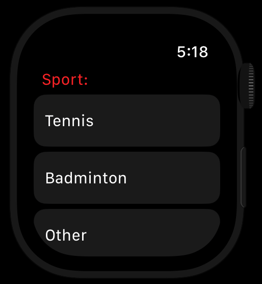

Always had a hard time keeping track of scores?  
Not anymore, minimal WatchOS app is here to help you out

    

        
        
Home screen with sport selection

    

    

        
        
Score keeping in action with reset functionality

    

